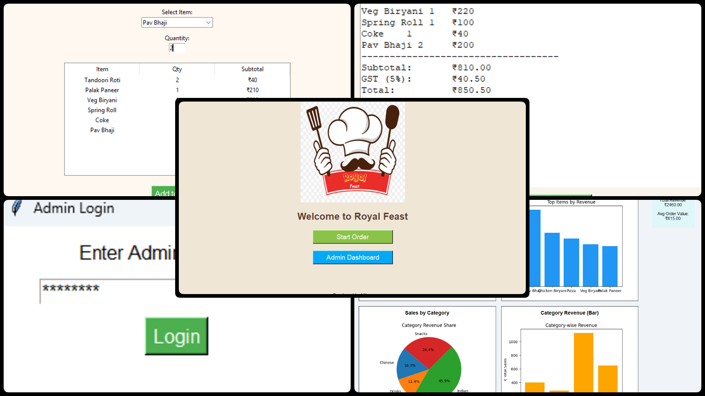

# 🍽️ Royal Feast Analytics Dashboard

## 📘 Introduction

Managing restaurant operations can be overwhelming without **real-time insights**. The **Royal Feast Analytics Dashboard** is a powerful desktop-based data visualization and analysis tool developed using **Python's Tkinter** library. It allows restaurant managers to analyze food sales, understand customer preferences, and make informed business decisions quickly and effectively.

### ✅ Why This Project?

- 📊 To provide restaurant owners with easy-to-understand visual reports of daily sales.
- 🧠 To analyze which items or categories generate the most revenue.
- 📁 To store order data in Excel for **permanent records and analysis**.

### 🚀 How It's Useful?

- Helps make data-driven decisions for menu planning.
- Tracks peak hours, best-selling dishes, and daily performance.
- Empowers non-technical users to explore analytics through a clean GUI.
- Easily extendable for billing, user authentication, and multi-user roles.

## 🚀 How It Works

This project is modular and organized into **4 Python files**, each with a specific role:

---

## 🧩 Project Structure

| File Name            | Purpose                                                                 |
|----------------------|-------------------------------------------------------------------------|
| `welcome_window.py`  | Launch screen that lets users go to order system or login as admin      |
| `order_window.py`    | GUI for placing food orders; stores data into `orders.xlsx`             |
| `dashboard.py`       | Admin analytics dashboard with charts, scrollable layout, and summary   |
| `login_window.py`    | Handles secure admin login before accessing the dashboard               |

## ⚙️ Core Functionalities

### 📁 1. Excel-Based Data Storage

All orders are stored in an `orders.xlsx` file, including:
- DateTime of order
- Item name
- Quantity
- Subtotal
This ensures data **persistence** and allows for **long-term tracking**.

---

### 🔐 2. Password Protection (Optional Enhancement)

Before accessing the dashboard, users must pass through a **login screen**:

- ✅ Admin username and password check
- ✅ Error handling for invalid login
- ✅ Prevents unauthorized access to data insights
---

### 📈 3. Interactive Charts & Visualizations

The dashboard displays **4 dynamic graphs** in a 2x2 layout:
1. **Top 5 Selling Items by Quantity**
2. **Top Revenue Generating Items**
3. **Sales by Category (Pie Chart)**
4. **Category-wise Total Revenue (Bar Chart)**

All visuals are generated using **Matplotlib** and rendered inside the GUI via `FigureCanvasTkAgg`.

---
### 🖼️ Screenshot of Project

## 👨‍💻 About the Developer

**👋 Hi, I'm vikas**

- 💼 I am a passionate Python developer and data analyst.

- 🚀 Projects include:
  - Lung cancer Dashboard
  - Gyani Baba AI
  - BitCheck Crypto Tracker
  - Restaurant Management System
  - ColorBlindness Test
  - AcuWeather Dashboard
